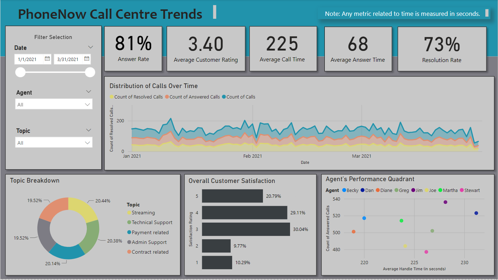
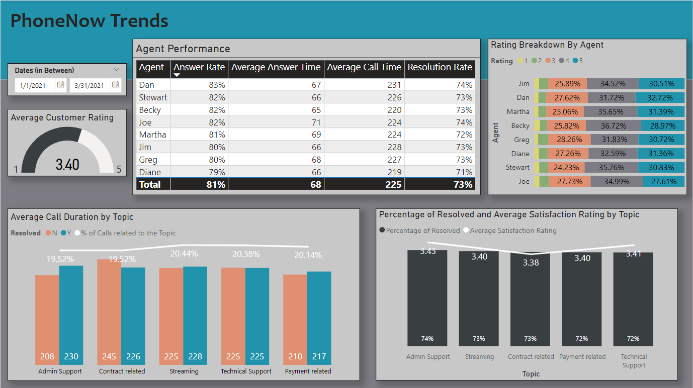
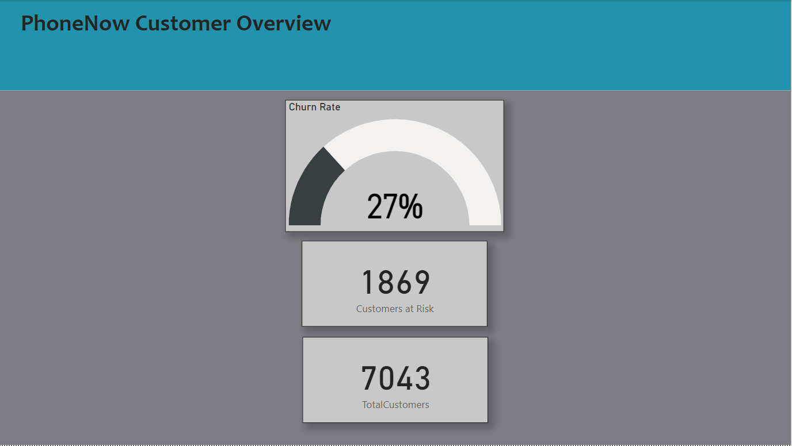
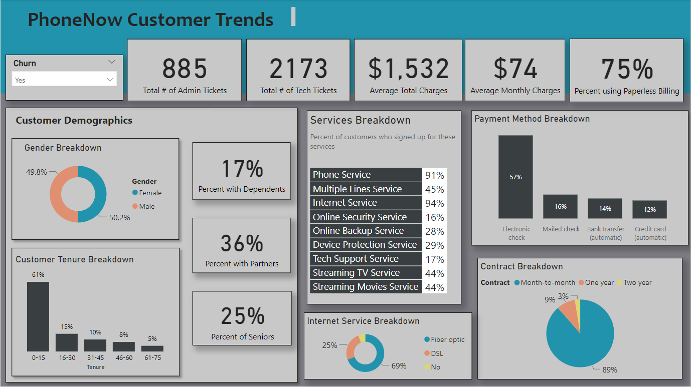
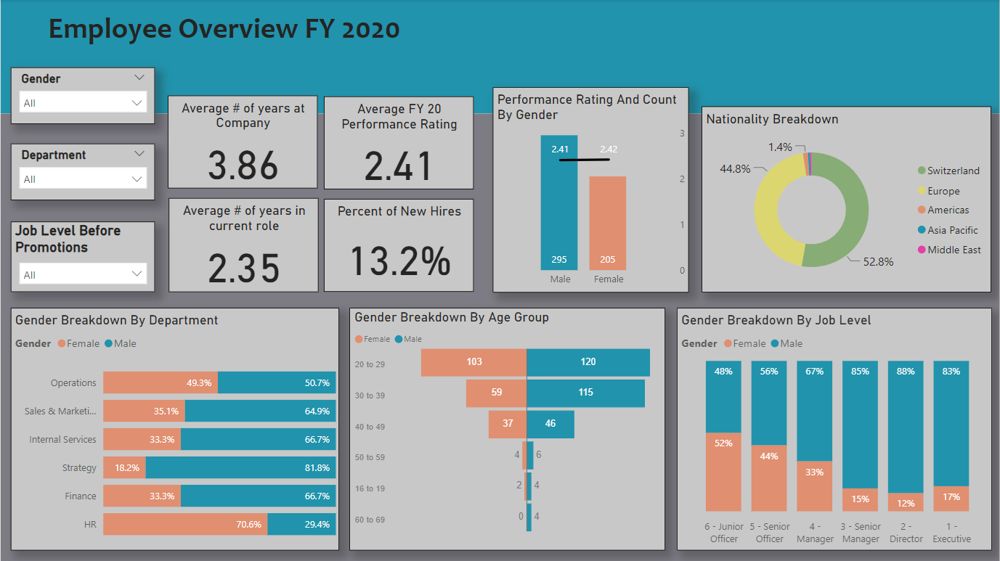
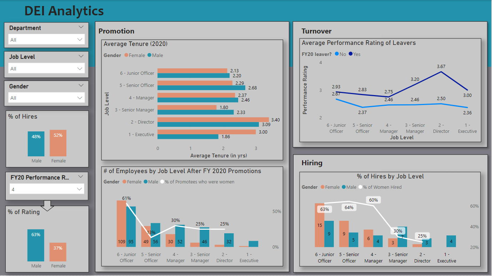

# ✨ PhoneNow Call Centre Analytics

## About the project: 
PhoneNow is a fictional big telecom company client who is seeking PwC's expertise to understand their data.
The project involves creating 3 Power BI dashboards, each designed to showcase Key Performance Indicators (KPIs) and metrics derived from data collected across call centers, customer interactions, and employee records. Our objective is to deliver valuable insights and actionable recommendations based on data analysis, supporting PhoneNow make data-driven decisions. 

## Task 1:
Claire, a Call Centre Manager at PhoneNow, is interested in an overview of long-term trends in agent behavior and enhanced transparency into their Call Centre data. 
 - To help her, we will create a dashboard in Power BI that reflects all relevant Key Performance Indicators (KPIs) and metrics derived from Call Centre data.
 - The Call-Center-Dataset contains information on 5000 customer calls. It has information such as average talk duration, satisfaction ratings, resolution status, speed of answer, and other relevant metrics.

| Call Centre Analytics | Agent and Topic Overview |
| -------- | ------- |
|  |  |

View the dashboard [here](https://app.powerbi.com/view?r=eyJrIjoiMWE1YzAzZDktZDRiZi00MDM3LThmYjYtMTRjYTg4OGQ4NmZkIiwidCI6ImU1MWNkZWM5LTgxMWQtNDcxZC1iYmU2LWRkM2Q4ZDU0YzI4YiIsImMiOjN9).

## Task 2:
In the telecom industry, customers are hard-earned. PhoneNow don’t want to lose them. Our goal is to help PhoneNow as it aims to proactively identify customers at risk of churn.
 - As a result, we are going to build a dashboard for the telecom Retention Manager at PhoneNow, focusing on customer retention and providing actionable recommendations.
 - The Churn-Dataset comprises information on about 7000 customers, including their churn status, service usage, charges, and demographic details.

#### Recommendations:
1. Direct marketing efforts towards customers on Month-to-Month contracts, urging them to transition to the more stable one-year contract option, as many churning customers are on Month-to-Month contracts.
2. Allocate additional resources to enhance technical support, given that a considerable number of technical inquiries are initiated by customers who subsequently churn. This proactive approach will improve customer satisfaction and retention.

| Call Centre Customer Overview | Call Centre Customer Trends |
| -------- | ------- |
|  |  |

View the dashboard [here](https://app.powerbi.com/view?r=eyJrIjoiMjEyMjNlMmMtM2M1NC00YjE5LWI2ZjMtNWY2MDZmZTQ3N2M5IiwidCI6ImU1MWNkZWM5LTgxMWQtNDcxZC1iYmU2LWRkM2Q4ZDU0YzI4YiIsImMiOjN9).

## Task 3:
The Human Resources team at PhoneNow have been working hard to improve gender balance at the executive management level, but they’re not seeing any progress. Companies need a workforce of diverse talents and backgrounds to succeed in an increasingly complex and heterogeneous world.
 - Hence, we are going to develop a dashboard to analyze hiring, promotion, and turnover data to identify some root causes of their slow progress.
 - The Diversity-Inclusion-Dataset encompasses hiring, promotion, turnover, and job information for 500 PhoneNow employees.

#### Root Causes for Gender Imbalance and Lack of Diversity:
* Hiring
  - The Strategy department, predominantly male, continues to hire more men than women, perpetuating gender imbalance.
  - Conversely, the HR department, predominantly female, continues to hire more women than men, further exacerbating the gender disparity.
  - Despite the higher rate of female hiring, fewer women are chosen for senior-level positions, indicating a need to investigate the factors contributing to this disparity.
* Turnover
  - Talented employees with high performance ratings are departing the company, indicating a need to provide incentives to retain them.
* Promotion
  - Despite women in senior-level positions often having higher performance ratings and longer tenure than their male counterparts, a smaller percentage of women are promoted to higher positions compared to men. Recognizing and rewarding highly talented women is imperative to fostering gender balance and ensuring equitable advancement opportunities.

| Employee Overview | DEI Analytics |
| -------- | ------- |
|  |  |

View the dashboard [here](https://app.powerbi.com/view?r=eyJrIjoiYTlmYTQwNTUtMzI3ZC00ZTY2LTg4YjEtMWViODRlNjBiZTQwIiwidCI6ImU1MWNkZWM5LTgxMWQtNDcxZC1iYmU2LWRkM2Q4ZDU0YzI4YiIsImMiOjN9).

## Tools used:
* Power BI

#### The project was completed through the PwC Switzerland - Power BI Job Simulation on Forage. The certificate of completion can be found [here](PwC.pdf).
